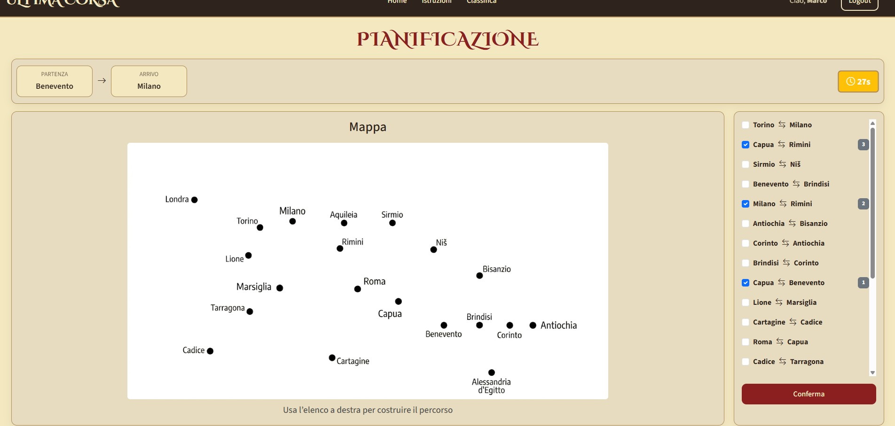

[](https://classroom.github.com/a/iZes9Qfg)

# Exam #1: "Ultima corsa"

## Student: s353342 RUSCITTO VIRGINIA

## React Client Application Routes

- Route `/`: **HomePage** - Displays the welcome page and a play button for authenticated users
- Route `/login`: **LoginPage** - Login form for unauthenticated users; redirects to / if already logged in
- Route `/instructions`: **InstructionsPage** - Game rules
- Route `/leaderboard`: **LeaderBoardPage** - Shows the leaderboard with the highest score achieved by each user. It is a protected route
- Route `/game`: **GamePage** - Manages the entire game flow through four phases: setup, planning, execution, and result. It is a protected route
- Route `*`: **NotFoundPage** - Deals with non-existing routes

## API Server

- **POST `/api/sessions`**
  - Request body: `{"username": "mrossi", "password": "marco01"}`
  - Response 201 Created: `{"id": 1, "username": "mrossi", "name": "Marco", "surname": "Rossi"}`
  - Response 401 Unauthorized: `{"message": "Incorrect username or password"}`
- **GET `/api/sessions/current`**
  - Response 200 OK: `{"id": 1, "username": "mrossi", "name": "Marco", "surname": "Rossi"}`
  - Response 401 Unauthorized: `{"error": "Unauthenticated user"}`
- **DELETE `/api/sessions/current`**
  - Response 204 No Content: No response body
  - Response 401 Unauthorized: `{"error": "Not authorized"}`
- **GET `/api/network`**
  - Response 200 OK:
    ```json
        {
          "connections": [
            {
              "id": 1,
              "stationAId": 1,
              "stationAName": "Roma",
              "stationBId": 2,
              "stationBName": "Capua"
            };
            {
              "id": 2,
              "stationAId": 2,
              "stationAName": "Capua",
              "stationBId": 3,
              "stationBName": "Benevento"
            }
          ]
        }
    ```
  - Response 401 Unauthorized: `{"error": "Not authorized"}`
  - Response 500 Internal Server Error: `{"error": "Cannot load network"}`
- **GET `/api/leaderboard`**
  - Response 200 OK:
    ```json
    [
      {
        "username": "mrossi",
        "bestScore": 24,
        "date": "03/06/2026 14:32"
      }
    ]
    ```
  - Response 401 Unauthorized: `{"error": "Not authorized"}`
  - Response 500 Internal Server Error: `{"error": "Cannot load leaderboard"}`
- **POST `/api/games`**
  - Request body: None
  - Response 201 Created:
    ```json
    {
      "id": 1,
      "startStation": { "id": 1, "name": "Roma" },
      "endStation": { "id": 6, "name": "Antiochia" },
      "playedAt": "2026-06-20 14:30:45"
    }
    ```
  - Response 401 Unauthorized: `{"error": "Not authorized"}`
  - Response 503 Service Unavailable: `{"error": "Network not ready"}`
  - Response 500 Internal Server Error: `{"error": "Cannot create game"}`
- **POST `/api/games/:id/route`**
  - Request body: `{"connectionIds": [1, 2, 3, 4, 5]}`
  - Response 200 OK (valid route):
    ```json
    {
      "valid": true,
      "segments": [
        {
          "from": "Roma",
          "to": "Capua",
          "lineName": "Linea I — Via Appia",
          "eventDescription": "Trovi una moneta d'oro sul pavimento del vagone",
          "coinEffect": 1,
          "coinsAfter": 21
        },
        {
          "from": "Capua",
          "to": "Benevento",
          "lineName": "Linea I — Via Appia",
          "eventDescription": "Guasto a una porta del convoglio: partenza ritardata",
          "coinEffect": -2,
          "coinsAfter": 19
        },
        {
          "from": "Benevento",
          "to": "Brindisi",
          "lineName": "Linea I — Via Appia",
          "eventDescription": "Viaggio tranquillo, niente di particolare",
          "coinEffect": 0,
          "coinsAfter": 19
        },
        {
          "from": "Brindisi",
          "to": "Corinto",
          "lineName": "Linea I — Via Appia",
          "eventDescription": "Un senatore in viaggio assegna una corsia preferenziale al convoglio",
          "coinEffect": 3,
          "coinsAfter": 22
        },
        {
          "from": "Corinto",
          "to": "Antiochia",
          "lineName": "Linea I — Via Appia",
          "eventDescription": "Un acquedotto in manutenzione rallenta il traffico ferroviario",
          "coinEffect": -3,
          "coinsAfter": 19
        }
      ],
      "finalScore": 19
    }
    ```
  - Response 200 OK (invalid route): `{"valid": false, reason: "invalid_path", "segments": [], "finalScore": 0}`
  - Response 400 Bad Request: `{"error": "Invalid data"}`
  - Response 401 Unauthorized: `{"error": "Not authorized"}`
  - Response 404 Not Found: `{"error": "Game not found"}`
  - Response 409 Conflict: `{"error": "Game already finalized"}`
  - Response 500 Internal Server Error: `{"error": "Cannot process route"}`

## Database Tables

- Table `users` - (id (PK), username (UNIQUE), name, surname, salt, password)
- Table `stations` - (id (PK), name (UNIQUE))
- Table `lines` - (id (PK), name (UNIQUE))
- Table `connections` - (id (PK), line_id (FK -> lines.id), station_a_id (FK -> stations.id), station_b_id (FK -> stations.id))
- Table `events` - (id (PK), description, effect)
- Table `games` - (id (PK), user_id (FK -> users.id), start_station_id (FK -> stations.id), end_station_id (FK -> stations.id), final_score, played_at)

## Main React Components

- `DefaultLayout` (in `layout/DefaultLayout.jsx`): shared application layout containing navigation bar and global alert messages provided through MessageContext
- `AppNavbar` (in `components/Navbar.jsx`): it includes links to some available routes and login/logout controls
- `LoginForm` (in `components/LoginForm.jsx`): controlled form that manages the insertion of user credentials
- `LeaderboardTable` (in `components/LeaderboardTable.jsx`): shows the leaderboard and highlights the current user's row
- `GamePage` (in `pages/GamePage.jsx`): it acts as a controller by managing the current game phase (setup, planning, execution, result) and the states across phases
- `SetupPhase` (in `components/game/SetupPhase.jsx`): displays the complete network map and allows the player to start a new game
- `PlanningPhase` (in `components/game/PlanningPhase.jsx`): handles the 90-second countdown timer, the selection of the route segments, and route submission
- `ExecutionPhase` (in `components/game/ExecutionPhase.jsx`): displays the journey step by step, showing random events and updating the coin total after each segment
- `ResultPhase` (in `components/game/ResultPhase.jsx`): displays the final score and route summary; allows the player to start a new game
- `useGameTimer` (in `components/game/hooks/useGameTimer.js`): custom hook that manages the planning phase countdown. Exposes timeLeft, expired, and start/stop. Internally uses a useEffect-driven timeout chain that decrements the counter every 1000ms

## Screenshot



## Users Credentials

|  Nome  | Cognome | Username | Password | Info |
| :----: | :-----: | :------: | :------: | :--: |
| Marco  |  Rossi  |  mrossi  | marco01  |      |
| Giulia | Bianchi | gbianchi | giulia01 |      |
|  Luca  |  Verdi  |  lverdi  |  luca01  |      |

## Use of AI Tools

- Implementation of graph algorithms (chatgpt)
- Creation of the custom useGameTimer hook (chatgpt)
- Support for CSS layout and styling refinement (chatgpt)
- Generation of subway route images (gemini)
- Creation of text for the instruction page (chatgpt)
- Definition of API error codes (chatgpt)
- Creation of database scripts and seed data (chatgpt)